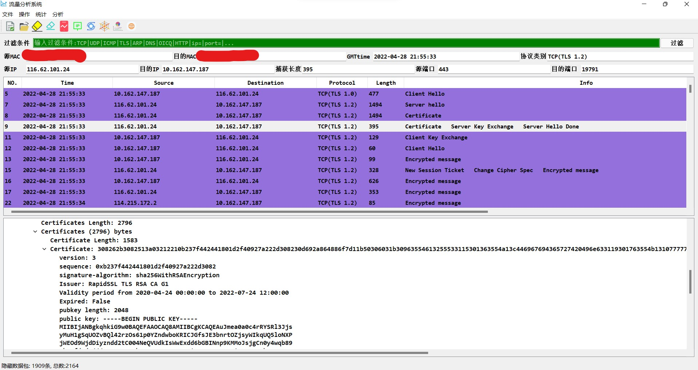

# traffic-analysis
# Introduction

这是一个用`python`编写的静态流量分析工具。主界面是对`pcap`的数据包解析以及每个包深度解析，支持`ARP`、`TCP`、`UDP`、`ICMP`、`DNS`、`TLS`、`http`协议的解析，对`TCP`重组报文解析也部分支持。

功能：

- [x] ip地址查询接口
- [x] DNS-whois查询
- [x] 流量统计
- [x] 流量简单分类
- [x] 批量导入报文(文件夹)
- [x] 筛选过滤报文
- [x] `DPI`
- [x] 网络图
- [ ] 动态抓包解析
- [ ] `MAC`地址信息
- [ ] 更多协议解析
- [ ] 数据库

# Environment

```python
python 3.6 +
python-whois == 0.7.3
matplotlib == 3.0.2
PyQt == 5.15.4
```

注：

1. `python-whois`运行时需要一个额外的数据文件`public_suffix_list.dat`，打包时需要将其显示导入。

2. `matplotlib`版本相对敏感，建议设置为`3.0.2`

# Demo



# Q&A

## UI文件转化为py文件

```python
pyuic5 -o mainwindow.py mainwindow.ui
```

在`qtDesigner`中设计完成后，可以使用上述命令，将`ui`文件导出为`py`文件。

## python文件封装为exe文件

```python
pyinstaller -F -w -i ./img/analysis.icon main.py
```

若已经产生`spec`文件，可以直接打包`spec`文件，命令不变

```python
pyinstaller -F main.spec
```

其中的`hiddenimports=[]`可以显示添加一些模块。若希望添加数据文件，可以在`binaries=[(),]`中以元组的形式添加。第一个值为添加文件的路径，第二个值为文件运行期望的路径。

很多时候，python封装完成后，会执行失败，尤其是找不到一些库，但报错的路径往往是`C`盘中找不到的一个路径。这是因为python执行`exe`会在`C`盘中创建一个临时文件夹，解压动态执行，执行结束后，会删除该文件，因此打包的模块需要使用相对路径。

## qrc文件转化为py文件

```python
pyrcc5 -o rosource_rc.py images.qrc
```

在界面设计中，可能需要使用很多资源文件，例如图片、音频，这些文件虽然可以使用本地文件路径直接导入，但在打包的时候会比较繁琐，通常的做法是将其导出为一个资源文件，python在打包时，会自动将其包含在内。